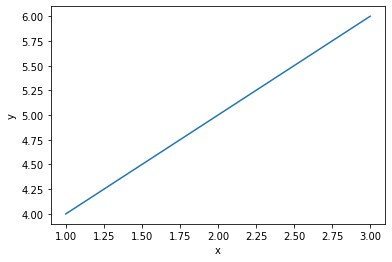

```python
a=1
```


```python
print (a)
```

    1


```python
%matplotlib inline
import matplotlib.pyplot as plt
plt.plot([1,2,3],[4,5,6])
plt.xlabel("x")
plt.ylabel("y")
# plt.savefig('tmp-plot.png')
```


    Text(0, 0.5, 'y')





This is a title
===============

This is a sub-title
-------------------
$\Delta x$

Exercise 1
========


```python
n1 = 4**3
n2 = 2 + 3.4**2
n3 = complex(1)**2
print (n1,n2,n3)
```

    64 13.559999999999999 (1+0j)


```python
s = "Spam egg spam spam"
```


```python
s[3]
```


    'm'


```python
s.upper()
```


    'SPAM EGG SPAM SPAM'


```python
s.lower()
```


    'spam egg spam spam'


```python
s.index('egg')
```


    5


```python
s.split()
```


    ['Spam', 'egg', 'spam', 'spam']


```python
li = [4, 5.5, "spam"]
```


```python
li.append(-2)

li
```


    [4, 5.5, 'spam', -2]


```python
li.insert(3,9)

li
```


    [4, 5.5, 'spam', 9, 9, -2]


Exercise 2
====


```python
a = "Hello, egg world!"
```


```python
an = a.split()[0]+' '+a.split()[2]
print (an)
```

    Hello, world!


```python
li = [3, 1, 2, 1]
```


```python
li.clear?
```

Exercise 3
====


```python
s = "CAGTACCAAGTGAAAGAT"
s.count('A')
```


    8


```python
s.count?
```


```python
a = [1, 2, 3]
b = [4, 5, 6]
```


```python
c = a.copy()+b.copy()
print (c)
```

    [1, 2, 3, 4, 5, 6]


```python
import numpy as np
np.round([15.4,15.5])
```


    array([15., 16.])


Booleans, Tuples & Dict.
=====
Exercise 1
----------


```python
x = 3.7
x>3.4 and x<= 6.6 or x==2
```


    True


```python
t = (1,2,3,'tmp')
```


```python
t[-1]
```


    'tmp'


```python
d = {'a':1,'b':55,'c':12}
d['a']
```


    1


```python
d['r'] =90
d
```


    {'a': 1, 'b': 55, 'c': 12, 'r': 90}


```python
e={}
e['a-string']=3.3
e[3445] = 2.2
e[complex(2,1)]='value'
print (e)
```

    {'a-string': 3.3, 3445: 2.2, (2+1j): 'value'}


```python
'b' in d
```


    True


Exercise 2
---------


```python
dg = {'I':'Ich', 'am':'bin', 'student':'studente'}
dg['I']+' '+dg['am']+' '+dg['student']
```


    'Ich bin studente'


Control flow
=========

Exercise 1&2
-------


```python
for i in range(1000):
    for j in range(2,i):
        if i%j==0:
            break
    else:
        print (i,' is prime')
```

    0  is prime
    1  is prime
    2  is prime
    3  is prime
    5  is prime
    7  is prime
    11  is prime
    13  is prime
    17  is prime
    19  is prime
    23  is prime
    29  is prime
    31  is prime
    37  is prime
    41  is prime
    43  is prime
    47  is prime
    53  is prime
    59  is prime
    61  is prime
    67  is prime
    71  is prime
    73  is prime
    79  is prime
    83  is prime
    89  is prime
    97  is prime
    101  is prime
    103  is prime
    107  is prime
    109  is prime
    113  is prime
    127  is prime
    131  is prime
    137  is prime
    139  is prime
    149  is prime
    151  is prime
    157  is prime
    163  is prime
    167  is prime
    173  is prime
    179  is prime
    181  is prime
    191  is prime
    193  is prime
    197  is prime
    199  is prime
    211  is prime
    223  is prime
    227  is prime
    229  is prime
    233  is prime
    239  is prime
    241  is prime
    251  is prime
    257  is prime
    263  is prime
    269  is prime
    271  is prime
    277  is prime
    281  is prime
    283  is prime
    293  is prime
    307  is prime
    311  is prime
    313  is prime
    317  is prime
    331  is prime
    337  is prime
    347  is prime
    349  is prime
    353  is prime
    359  is prime
    367  is prime
    373  is prime
    379  is prime
    383  is prime
    389  is prime
    397  is prime
    401  is prime
    409  is prime
    419  is prime
    421  is prime
    431  is prime
    433  is prime
    439  is prime
    443  is prime
    449  is prime
    457  is prime
    461  is prime
    463  is prime
    467  is prime
    479  is prime
    487  is prime
    491  is prime
    499  is prime
    503  is prime
    509  is prime
    521  is prime
    523  is prime
    541  is prime
    547  is prime
    557  is prime
    563  is prime
    569  is prime
    571  is prime
    577  is prime
    587  is prime
    593  is prime
    599  is prime
    601  is prime
    607  is prime
    613  is prime
    617  is prime
    619  is prime
    631  is prime
    641  is prime
    643  is prime
    647  is prime
    653  is prime
    659  is prime
    661  is prime
    673  is prime
    677  is prime
    683  is prime
    691  is prime
    701  is prime
    709  is prime
    719  is prime
    727  is prime
    733  is prime
    739  is prime
    743  is prime
    751  is prime
    757  is prime
    761  is prime
    769  is prime
    773  is prime
    787  is prime
    797  is prime
    809  is prime
    811  is prime
    821  is prime
    823  is prime
    827  is prime
    829  is prime
    839  is prime
    853  is prime
    857  is prime
    859  is prime
    863  is prime
    877  is prime
    881  is prime
    883  is prime
    887  is prime
    907  is prime
    911  is prime
    919  is prime
    929  is prime
    937  is prime
    941  is prime
    947  is prime
    953  is prime
    967  is prime
    971  is prime
    977  is prime
    983  is prime
    991  is prime
    997  is prime


```python
for i in range(8):
    if i==2 or i==4:
        continue
    print (i)
```

    0
    1
    3
    5
    6
    7


Exercise 3
----------


```python
i=0
f = [0,1]
while (f[-1]+f[-2])<100000:
    f.append(f[-2]+f[-1])
    i+=1
print (f)
```

    [0, 1, 1, 2, 3, 5, 8, 13, 21, 34, 55, 89, 144, 233, 377, 610, 987, 1597, 2584, 4181, 6765, 10946, 17711, 28657, 46368, 75025]


```python
fn = []
i=0
for n1 in f:
    #print (n1)
    for n2 in f[i+1:]:
        if n1**2==n2:
            fn.append(n1)
    i+=1

print (fn)
```

    [1]


Practice problem "caesar cipher"
---------------

Way 1
-------


```python
def caesar_meth(string,shift):
    nstring = ''
    #chk for spaces
    for let in string:
        if let == ' ':
            nlet = ' '
        else:
            let2a = ord(let)+shift
            #check for ascii ordergin out of bounds
            if let2a > ord('z'):
                let2a-=26
            elif let2a < ord('a'):
                let2a+=26
            nlet = chr(let2a)

        nstring += nlet

    return nstring
```


```python
print(caesar_meth("pbatenghyngvbaf lbh unir fhpprrqrq va qrpelcgvat gur fgevat", -13))
```

    congratulations you have succeeded in decrypting the string


```python
for shift in range(26):
    print(shift, caesar_meth("gwc uivioml bw nqvl bpm zqopb apqnb", -shift))
```

    0 gwc uivioml bw nqvl bpm zqopb apqnb
    1 fvb thuhnlk av mpuk aol ypnoa zopma
    2 eua sgtgmkj zu lotj znk xomnz ynolz
    3 dtz rfsflji yt knsi ymj wnlmy xmnky
    4 csy qerekih xs jmrh xli vmklx wlmjx
    5 brx pdqdjhg wr ilqg wkh uljkw vkliw
    6 aqw ocpcigf vq hkpf vjg tkijv ujkhv
    7 zpv nbobhfe up gjoe uif sjhiu tijgu
    8 you managed to find the right shift
    9 xnt lzmzfdc sn ehmc sgd qhfgs rghes
    10 wms kylyecb rm dglb rfc pgefr qfgdr
    11 vlr jxkxdba ql cfka qeb ofdeq pefcq
    12 ukq iwjwcaz pk bejz pda necdp odebp
    13 tjp hvivbzy oj adiy ocz mdbco ncdao
    14 sio guhuayx ni zchx nby lcabn mbczn
    15 rhn ftgtzxw mh ybgw max kbzam labym
    16 qgm esfsywv lg xafv lzw jayzl kzaxl
    17 pfl drerxvu kf wzeu kyv izxyk jyzwk
    18 oek cqdqwut je vydt jxu hywxj ixyvj
    19 ndj bpcpvts id uxcs iwt gxvwi hwxui
    20 mci aobousr hc twbr hvs fwuvh gvwth
    21 lbh znantrq gb svaq gur evtug fuvsg
    22 kag ymzmsqp fa ruzp ftq dustf eturf
    23 jzf xlylrpo ez qtyo esp ctrse dstqe
    24 iye wkxkqon dy psxn dro bsqrd crspd
    25 hxd vjwjpnm cx orwm cqn arpqc bqroc


Way 2
----------


```python
import string
p=string.ascii_lowercase
p
```


    'abcdefghijklmnopqrstuvwxyz'


```python
em = 'pbatenghyngvbaf lbh unir fhpprrqrq va qrpelcgvat gur fgevat'
```


```python
c = ''
for i in em:
    if i!=' ':
        c += p[p.find(i)-13]
    else:
        c+= ' '

c
```


    'congratulations you have succeeded in decrypting the string'


```python
em2 = 'gwc uivioml bw nqvl bpm zqopb apqnb'
c2 = []
for j in range(len(p)):
    for i in em2:
        if i!=' ':
            c2.append(p[p.find(i)-j])
        else:
            c2.append(' ')
print 
c2
```


    '0gwc uivioml bw nqvl bpm zqopb apqnb1gwc uivioml bw nqvl bpm zqopb apqnbfvb thuhnlk av mpuk aol ypnoa zopma2gwc uivioml bw nqvl bpm zqopb apqnbfvb thuhnlk av mpuk aol ypnoa zopmaeua sgtgmkj zu lotj znk xomnz ynolz3gwc uivioml bw nqvl bpm zqopb apqnbfvb thuhnlk av mpuk aol ypnoa zopmaeua sgtgmkj zu lotj znk xomnz ynolzdtz rfsflji yt knsi ymj wnlmy xmnky4gwc uivioml bw nqvl bpm zqopb apqnbfvb thuhnlk av mpuk aol ypnoa zopmaeua sgtgmkj zu lotj znk xomnz ynolzdtz rfsflji yt knsi ymj wnlmy xmnkycsy qerekih xs jmrh xli vmklx wlmjx5gwc uivioml bw nqvl bpm zqopb apqnbfvb thuhnlk av mpuk aol ypnoa zopmaeua sgtgmkj zu lotj znk xomnz ynolzdtz rfsflji yt knsi ymj wnlmy xmnkycsy qerekih xs jmrh xli vmklx wlmjxbrx pdqdjhg wr ilqg wkh uljkw vkliw6gwc uivioml bw nqvl bpm zqopb apqnbfvb thuhnlk av mpuk aol ypnoa zopmaeua sgtgmkj zu lotj znk xomnz ynolzdtz rfsflji yt knsi ymj wnlmy xmnkycsy qerekih xs jmrh xli vmklx wlmjxbrx pdqdjhg wr ilqg wkh uljkw vkliwaqw ocpcigf vq hkpf vjg tkijv ujkhv7gwc uivioml bw nqvl bpm zqopb apqnbfvb thuhnlk av mpuk aol ypnoa zopmaeua sgtgmkj zu lotj znk xomnz ynolzdtz rfsflji yt knsi ymj wnlmy xmnkycsy qerekih xs jmrh xli vmklx wlmjxbrx pdqdjhg wr ilqg wkh uljkw vkliwaqw ocpcigf vq hkpf vjg tkijv ujkhvzpv nbobhfe up gjoe uif sjhiu tijgu8gwc uivioml bw nqvl bpm zqopb apqnbfvb thuhnlk av mpuk aol ypnoa zopmaeua sgtgmkj zu lotj znk xomnz ynolzdtz rfsflji yt knsi ymj wnlmy xmnkycsy qerekih xs jmrh xli vmklx wlmjxbrx pdqdjhg wr ilqg wkh uljkw vkliwaqw ocpcigf vq hkpf vjg tkijv ujkhvzpv nbobhfe up gjoe uif sjhiu tijguyou managed to find the right shift9gwc uivioml bw nqvl bpm zqopb apqnbfvb thuhnlk av mpuk aol ypnoa zopmaeua sgtgmkj zu lotj znk xomnz ynolzdtz rfsflji yt knsi ymj wnlmy xmnkycsy qerekih xs jmrh xli vmklx wlmjxbrx pdqdjhg wr ilqg wkh uljkw vkliwaqw ocpcigf vq hkpf vjg tkijv ujkhvzpv nbobhfe up gjoe uif sjhiu tijguyou managed to find the right shiftxnt lzmzfdc sn ehmc sgd qhfgs rghes10gwc uivioml bw nqvl bpm zqopb apqnbfvb thuhnlk av mpuk aol ypnoa zopmaeua sgtgmkj zu lotj znk xomnz ynolzdtz rfsflji yt knsi ymj wnlmy xmnkycsy qerekih xs jmrh xli vmklx wlmjxbrx pdqdjhg wr ilqg wkh uljkw vkliwaqw ocpcigf vq hkpf vjg tkijv ujkhvzpv nbobhfe up gjoe uif sjhiu tijguyou managed to find the right shiftxnt lzmzfdc sn ehmc sgd qhfgs rgheswms kylyecb rm dglb rfc pgefr qfgdr11gwc uivioml bw nqvl bpm zqopb apqnbfvb thuhnlk av mpuk aol ypnoa zopmaeua sgtgmkj zu lotj znk xomnz ynolzdtz rfsflji yt knsi ymj wnlmy xmnkycsy qerekih xs jmrh xli vmklx wlmjxbrx pdqdjhg wr ilqg wkh uljkw vkliwaqw ocpcigf vq hkpf vjg tkijv ujkhvzpv nbobhfe up gjoe uif sjhiu tijguyou managed to find the right shiftxnt lzmzfdc sn ehmc sgd qhfgs rgheswms kylyecb rm dglb rfc pgefr qfgdrvlr jxkxdba ql cfka qeb ofdeq pefcq12gwc uivioml bw nqvl bpm zqopb apqnbfvb thuhnlk av mpuk aol ypnoa zopmaeua sgtgmkj zu lotj znk xomnz ynolzdtz rfsflji yt knsi ymj wnlmy xmnkycsy qerekih xs jmrh xli vmklx wlmjxbrx pdqdjhg wr ilqg wkh uljkw vkliwaqw ocpcigf vq hkpf vjg tkijv ujkhvzpv nbobhfe up gjoe uif sjhiu tijguyou managed to find the right shiftxnt lzmzfdc sn ehmc sgd qhfgs rgheswms kylyecb rm dglb rfc pgefr qfgdrvlr jxkxdba ql cfka qeb ofdeq pefcqukq iwjwcaz pk bejz pda necdp odebp13gwc uivioml bw nqvl bpm zqopb apqnbfvb thuhnlk av mpuk aol ypnoa zopmaeua sgtgmkj zu lotj znk xomnz ynolzdtz rfsflji yt knsi ymj wnlmy xmnkycsy qerekih xs jmrh xli vmklx wlmjxbrx pdqdjhg wr ilqg wkh uljkw vkliwaqw ocpcigf vq hkpf vjg tkijv ujkhvzpv nbobhfe up gjoe uif sjhiu tijguyou managed to find the right shiftxnt lzmzfdc sn ehmc sgd qhfgs rgheswms kylyecb rm dglb rfc pgefr qfgdrvlr jxkxdba ql cfka qeb ofdeq pefcqukq iwjwcaz pk bejz pda necdp odebptjp hvivbzy oj adiy ocz mdbco ncdao14gwc uivioml bw nqvl bpm zqopb apqnbfvb thuhnlk av mpuk aol ypnoa zopmaeua sgtgmkj zu lotj znk xomnz ynolzdtz rfsflji yt knsi ymj wnlmy xmnkycsy qerekih xs jmrh xli vmklx wlmjxbrx pdqdjhg wr ilqg wkh uljkw vkliwaqw ocpcigf vq hkpf vjg tkijv ujkhvzpv nbobhfe up gjoe uif sjhiu tijguyou managed to find the right shiftxnt lzmzfdc sn ehmc sgd qhfgs rgheswms kylyecb rm dglb rfc pgefr qfgdrvlr jxkxdba ql cfka qeb ofdeq pefcqukq iwjwcaz pk bejz pda necdp odebptjp hvivbzy oj adiy ocz mdbco ncdaosio guhuayx ni zchx nby lcabn mbczn15gwc uivioml bw nqvl bpm zqopb apqnbfvb thuhnlk av mpuk aol ypnoa zopmaeua sgtgmkj zu lotj znk xomnz ynolzdtz rfsflji yt knsi ymj wnlmy xmnkycsy qerekih xs jmrh xli vmklx wlmjxbrx pdqdjhg wr ilqg wkh uljkw vkliwaqw ocpcigf vq hkpf vjg tkijv ujkhvzpv nbobhfe up gjoe uif sjhiu tijguyou managed to find the right shiftxnt lzmzfdc sn ehmc sgd qhfgs rgheswms kylyecb rm dglb rfc pgefr qfgdrvlr jxkxdba ql cfka qeb ofdeq pefcqukq iwjwcaz pk bejz pda necdp odebptjp hvivbzy oj adiy ocz mdbco ncdaosio guhuayx ni zchx nby lcabn mbcznrhn ftgtzxw mh ybgw max kbzam labym16gwc uivioml bw nqvl bpm zqopb apqnbfvb thuhnlk av mpuk aol ypnoa zopmaeua sgtgmkj zu lotj znk xomnz ynolzdtz rfsflji yt knsi ymj wnlmy xmnkycsy qerekih xs jmrh xli vmklx wlmjxbrx pdqdjhg wr ilqg wkh uljkw vkliwaqw ocpcigf vq hkpf vjg tkijv ujkhvzpv nbobhfe up gjoe uif sjhiu tijguyou managed to find the right shiftxnt lzmzfdc sn ehmc sgd qhfgs rgheswms kylyecb rm dglb rfc pgefr qfgdrvlr jxkxdba ql cfka qeb ofdeq pefcqukq iwjwcaz pk bejz pda necdp odebptjp hvivbzy oj adiy ocz mdbco ncdaosio guhuayx ni zchx nby lcabn mbcznrhn ftgtzxw mh ybgw max kbzam labymqgm esfsywv lg xafv lzw jayzl kzaxl17gwc uivioml bw nqvl bpm zqopb apqnbfvb thuhnlk av mpuk aol ypnoa zopmaeua sgtgmkj zu lotj znk xomnz ynolzdtz rfsflji yt knsi ymj wnlmy xmnkycsy qerekih xs jmrh xli vmklx wlmjxbrx pdqdjhg wr ilqg wkh uljkw vkliwaqw ocpcigf vq hkpf vjg tkijv ujkhvzpv nbobhfe up gjoe uif sjhiu tijguyou managed to find the right shiftxnt lzmzfdc sn ehmc sgd qhfgs rgheswms kylyecb rm dglb rfc pgefr qfgdrvlr jxkxdba ql cfka qeb ofdeq pefcqukq iwjwcaz pk bejz pda necdp odebptjp hvivbzy oj adiy ocz mdbco ncdaosio guhuayx ni zchx nby lcabn mbcznrhn ftgtzxw mh ybgw max kbzam labymqgm esfsywv lg xafv lzw jayzl kzaxlpfl drerxvu kf wzeu kyv izxyk jyzwk18gwc uivioml bw nqvl bpm zqopb apqnbfvb thuhnlk av mpuk aol ypnoa zopmaeua sgtgmkj zu lotj znk xomnz ynolzdtz rfsflji yt knsi ymj wnlmy xmnkycsy qerekih xs jmrh xli vmklx wlmjxbrx pdqdjhg wr ilqg wkh uljkw vkliwaqw ocpcigf vq hkpf vjg tkijv ujkhvzpv nbobhfe up gjoe uif sjhiu tijguyou managed to find the right shiftxnt lzmzfdc sn ehmc sgd qhfgs rgheswms kylyecb rm dglb rfc pgefr qfgdrvlr jxkxdba ql cfka qeb ofdeq pefcqukq iwjwcaz pk bejz pda necdp odebptjp hvivbzy oj adiy ocz mdbco ncdaosio guhuayx ni zchx nby lcabn mbcznrhn ftgtzxw mh ybgw max kbzam labymqgm esfsywv lg xafv lzw jayzl kzaxlpfl drerxvu kf wzeu kyv izxyk jyzwkoek cqdqwut je vydt jxu hywxj ixyvj19gwc uivioml bw nqvl bpm zqopb apqnbfvb thuhnlk av mpuk aol ypnoa zopmaeua sgtgmkj zu lotj znk xomnz ynolzdtz rfsflji yt knsi ymj wnlmy xmnkycsy qerekih xs jmrh xli vmklx wlmjxbrx pdqdjhg wr ilqg wkh uljkw vkliwaqw ocpcigf vq hkpf vjg tkijv ujkhvzpv nbobhfe up gjoe uif sjhiu tijguyou managed to find the right shiftxnt lzmzfdc sn ehmc sgd qhfgs rgheswms kylyecb rm dglb rfc pgefr qfgdrvlr jxkxdba ql cfka qeb ofdeq pefcqukq iwjwcaz pk bejz pda necdp odebptjp hvivbzy oj adiy ocz mdbco ncdaosio guhuayx ni zchx nby lcabn mbcznrhn ftgtzxw mh ybgw max kbzam labymqgm esfsywv lg xafv lzw jayzl kzaxlpfl drerxvu kf wzeu kyv izxyk jyzwkoek cqdqwut je vydt jxu hywxj ixyvjndj bpcpvts id uxcs iwt gxvwi hwxui20gwc uivioml bw nqvl bpm zqopb apqnbfvb thuhnlk av mpuk aol ypnoa zopmaeua sgtgmkj zu lotj znk xomnz ynolzdtz rfsflji yt knsi ymj wnlmy xmnkycsy qerekih xs jmrh xli vmklx wlmjxbrx pdqdjhg wr ilqg wkh uljkw vkliwaqw ocpcigf vq hkpf vjg tkijv ujkhvzpv nbobhfe up gjoe uif sjhiu tijguyou managed to find the right shiftxnt lzmzfdc sn ehmc sgd qhfgs rgheswms kylyecb rm dglb rfc pgefr qfgdrvlr jxkxdba ql cfka qeb ofdeq pefcqukq iwjwcaz pk bejz pda necdp odebptjp hvivbzy oj adiy ocz mdbco ncdaosio guhuayx ni zchx nby lcabn mbcznrhn ftgtzxw mh ybgw max kbzam labymqgm esfsywv lg xafv lzw jayzl kzaxlpfl drerxvu kf wzeu kyv izxyk jyzwkoek cqdqwut je vydt jxu hywxj ixyvjndj bpcpvts id uxcs iwt gxvwi hwxuimci aobousr hc twbr hvs fwuvh gvwth21gwc uivioml bw nqvl bpm zqopb apqnbfvb thuhnlk av mpuk aol ypnoa zopmaeua sgtgmkj zu lotj znk xomnz ynolzdtz rfsflji yt knsi ymj wnlmy xmnkycsy qerekih xs jmrh xli vmklx wlmjxbrx pdqdjhg wr ilqg wkh uljkw vkliwaqw ocpcigf vq hkpf vjg tkijv ujkhvzpv nbobhfe up gjoe uif sjhiu tijguyou managed to find the right shiftxnt lzmzfdc sn ehmc sgd qhfgs rgheswms kylyecb rm dglb rfc pgefr qfgdrvlr jxkxdba ql cfka qeb ofdeq pefcqukq iwjwcaz pk bejz pda necdp odebptjp hvivbzy oj adiy ocz mdbco ncdaosio guhuayx ni zchx nby lcabn mbcznrhn ftgtzxw mh ybgw max kbzam labymqgm esfsywv lg xafv lzw jayzl kzaxlpfl drerxvu kf wzeu kyv izxyk jyzwkoek cqdqwut je vydt jxu hywxj ixyvjndj bpcpvts id uxcs iwt gxvwi hwxuimci aobousr hc twbr hvs fwuvh gvwthlbh znantrq gb svaq gur evtug fuvsg22gwc uivioml bw nqvl bpm zqopb apqnbfvb thuhnlk av mpuk aol ypnoa zopmaeua sgtgmkj zu lotj znk xomnz ynolzdtz rfsflji yt knsi ymj wnlmy xmnkycsy qerekih xs jmrh xli vmklx wlmjxbrx pdqdjhg wr ilqg wkh uljkw vkliwaqw ocpcigf vq hkpf vjg tkijv ujkhvzpv nbobhfe up gjoe uif sjhiu tijguyou managed to find the right shiftxnt lzmzfdc sn ehmc sgd qhfgs rgheswms kylyecb rm dglb rfc pgefr qfgdrvlr jxkxdba ql cfka qeb ofdeq pefcqukq iwjwcaz pk bejz pda necdp odebptjp hvivbzy oj adiy ocz mdbco ncdaosio guhuayx ni zchx nby lcabn mbcznrhn ftgtzxw mh ybgw max kbzam labymqgm esfsywv lg xafv lzw jayzl kzaxlpfl drerxvu kf wzeu kyv izxyk jyzwkoek cqdqwut je vydt jxu hywxj ixyvjndj bpcpvts id uxcs iwt gxvwi hwxuimci aobousr hc twbr hvs fwuvh gvwthlbh znantrq gb svaq gur evtug fuvsgkag ymzmsqp fa ruzp ftq dustf eturf23gwc uivioml bw nqvl bpm zqopb apqnbfvb thuhnlk av mpuk aol ypnoa zopmaeua sgtgmkj zu lotj znk xomnz ynolzdtz rfsflji yt knsi ymj wnlmy xmnkycsy qerekih xs jmrh xli vmklx wlmjxbrx pdqdjhg wr ilqg wkh uljkw vkliwaqw ocpcigf vq hkpf vjg tkijv ujkhvzpv nbobhfe up gjoe uif sjhiu tijguyou managed to find the right shiftxnt lzmzfdc sn ehmc sgd qhfgs rgheswms kylyecb rm dglb rfc pgefr qfgdrvlr jxkxdba ql cfka qeb ofdeq pefcqukq iwjwcaz pk bejz pda necdp odebptjp hvivbzy oj adiy ocz mdbco ncdaosio guhuayx ni zchx nby lcabn mbcznrhn ftgtzxw mh ybgw max kbzam labymqgm esfsywv lg xafv lzw jayzl kzaxlpfl drerxvu kf wzeu kyv izxyk jyzwkoek cqdqwut je vydt jxu hywxj ixyvjndj bpcpvts id uxcs iwt gxvwi hwxuimci aobousr hc twbr hvs fwuvh gvwthlbh znantrq gb svaq gur evtug fuvsgkag ymzmsqp fa ruzp ftq dustf eturfjzf xlylrpo ez qtyo esp ctrse dstqe24gwc uivioml bw nqvl bpm zqopb apqnbfvb thuhnlk av mpuk aol ypnoa zopmaeua sgtgmkj zu lotj znk xomnz ynolzdtz rfsflji yt knsi ymj wnlmy xmnkycsy qerekih xs jmrh xli vmklx wlmjxbrx pdqdjhg wr ilqg wkh uljkw vkliwaqw ocpcigf vq hkpf vjg tkijv ujkhvzpv nbobhfe up gjoe uif sjhiu tijguyou managed to find the right shiftxnt lzmzfdc sn ehmc sgd qhfgs rgheswms kylyecb rm dglb rfc pgefr qfgdrvlr jxkxdba ql cfka qeb ofdeq pefcqukq iwjwcaz pk bejz pda necdp odebptjp hvivbzy oj adiy ocz mdbco ncdaosio guhuayx ni zchx nby lcabn mbcznrhn ftgtzxw mh ybgw max kbzam labymqgm esfsywv lg xafv lzw jayzl kzaxlpfl drerxvu kf wzeu kyv izxyk jyzwkoek cqdqwut je vydt jxu hywxj ixyvjndj bpcpvts id uxcs iwt gxvwi hwxuimci aobousr hc twbr hvs fwuvh gvwthlbh znantrq gb svaq gur evtug fuvsgkag ymzmsqp fa ruzp ftq dustf eturfjzf xlylrpo ez qtyo esp ctrse dstqeiye wkxkqon dy psxn dro bsqrd crspd25gwc uivioml bw nqvl bpm zqopb apqnbfvb thuhnlk av mpuk aol ypnoa zopmaeua sgtgmkj zu lotj znk xomnz ynolzdtz rfsflji yt knsi ymj wnlmy xmnkycsy qerekih xs jmrh xli vmklx wlmjxbrx pdqdjhg wr ilqg wkh uljkw vkliwaqw ocpcigf vq hkpf vjg tkijv ujkhvzpv nbobhfe up gjoe uif sjhiu tijguyou managed to find the right shiftxnt lzmzfdc sn ehmc sgd qhfgs rgheswms kylyecb rm dglb rfc pgefr qfgdrvlr jxkxdba ql cfka qeb ofdeq pefcqukq iwjwcaz pk bejz pda necdp odebptjp hvivbzy oj adiy ocz mdbco ncdaosio guhuayx ni zchx nby lcabn mbcznrhn ftgtzxw mh ybgw max kbzam labymqgm esfsywv lg xafv lzw jayzl kzaxlpfl drerxvu kf wzeu kyv izxyk jyzwkoek cqdqwut je vydt jxu hywxj ixyvjndj bpcpvts id uxcs iwt gxvwi hwxuimci aobousr hc twbr hvs fwuvh gvwthlbh znantrq gb svaq gur evtug fuvsgkag ymzmsqp fa ruzp ftq dustf eturfjzf xlylrpo ez qtyo esp ctrse dstqeiye wkxkqon dy psxn dro bsqrd crspdhxd vjwjpnm cx orwm cqn arpqc bqroc'


Functions
===========

Exercise 1
----


```python
def isprime(number):
    for j in range(2,number):
        if number%j==0:
            return False
            break            
        else:
            return True
```


```python
isprime(6)
```


    False


Exercise 2
---


```python
def factorial(num):
    if num>0:
        return num*factorial(num-1)
    else:
        return 1
```


```python
factorial(5)
```


    120


Exercise 3
-----


```python
def mean(list):
    return sum(list)/len(list)
```


```python
mean([1, 3, 4, 5, 6, 7])

```


    4.333333333333333


Files rw
=======


```python
f = open('data/data.txt','r')
```


```python
type(f)
```


    _io.TextIOWrapper


```python
f.read()
```


    'RAJ        DEJ                          Jmag   e_Jmag\n2000 (deg) 2000 (deg) 2MASS             (mag)  (mag) \n---------- ---------- ----------------- ------ ------\n010.684737 +41.269035 00424433+4116085   9.453  0.052\n010.683469 +41.268585 00424403+4116069   9.321  0.022\n010.685657 +41.269550 00424455+4116103  10.773  0.069\n010.686026 +41.269226 00424464+4116092   9.299  0.063\n010.683465 +41.269676 00424403+4116108  11.507  0.056\n010.686015 +41.269630 00424464+4116106   9.399  0.045\n010.685270 +41.267124 00424446+4116016  12.070  0.035\n'


```python
f.read()
```


    ''


```python
data = f.read()
```


```python
data
```


    'RAJ        DEJ                          Jmag   e_Jmag\n2000 (deg) 2000 (deg) 2MASS             (mag)  (mag) \n---------- ---------- ----------------- ------ ------\n010.684737 +41.269035 00424433+4116085   9.453  0.052\n010.683469 +41.268585 00424403+4116069   9.321  0.022\n010.685657 +41.269550 00424455+4116103  10.773  0.069\n010.686026 +41.269226 00424464+4116092   9.299  0.063\n010.683465 +41.269676 00424403+4116108  11.507  0.056\n010.686015 +41.269630 00424464+4116106   9.399  0.045\n010.685270 +41.267124 00424446+4116016  12.070  0.035\n'


```python
for i in f:
    print(repr(i))
```

    'RAJ        DEJ                          Jmag   e_Jmag\n'
    '2000 (deg) 2000 (deg) 2MASS             (mag)  (mag) \n'
    '---------- ---------- ----------------- ------ ------\n'
    '010.684737 +41.269035 00424433+4116085   9.453  0.052\n'
    '010.683469 +41.268585 00424403+4116069   9.321  0.022\n'
    '010.685657 +41.269550 00424455+4116103  10.773  0.069\n'
    '010.686026 +41.269226 00424464+4116092   9.299  0.063\n'
    '010.683465 +41.269676 00424403+4116108  11.507  0.056\n'
    '010.686015 +41.269630 00424464+4116106   9.399  0.045\n'
    '010.685270 +41.267124 00424446+4116016  12.070  0.035\n'


```python
i
```


    '010.685270 +41.267124 00424446+4116016  12.070  0.035\n'


```python
f.readlines()
```


    ['RAJ        DEJ                          Jmag   e_Jmag\n',
     '2000 (deg) 2000 (deg) 2MASS             (mag)  (mag) \n',
     '---------- ---------- ----------------- ------ ------\n',
     '010.684737 +41.269035 00424433+4116085   9.453  0.052\n',
     '010.683469 +41.268585 00424403+4116069   9.321  0.022\n',
     '010.685657 +41.269550 00424455+4116103  10.773  0.069\n',
     '010.686026 +41.269226 00424464+4116092   9.299  0.063\n',
     '010.683465 +41.269676 00424403+4116108  11.507  0.056\n',
     '010.686015 +41.269630 00424464+4116106   9.399  0.045\n',
     '010.685270 +41.267124 00424446+4116016  12.070  0.035\n']


```python
line = i.strip()
```


```python
line
```


    '010.685270 +41.267124 00424446+4116016  12.070  0.035'


```python
columns = line.split()
```


```python
columns
```


    ['010.685270', '+41.267124', '00424446+4116016', '12.070', '0.035']


```python
name = columns[2]
jmag = columns[3]
```


```python
name, jmag
```


    ('00424446+4116016', '12.070')


```python
jm = float(jmag)
```


```python
jm
```


    12.07


Exercise 1
----


```python
# Open file
f = open('data/data.txt', 'r')

# Read and ignore header lines
header1 = f.readline()
header2 = f.readline()
header3 = f.readline()

# Loop over lines and extract variables of interest
jmag = {}
for line in f:
    line = line.strip()
    columns = line.split()
    name = columns[2]
    jmag[name] = float(columns[3])
    print(name, jmag[name])
```

    00424433+4116085 9.453
    00424403+4116069 9.321
    00424455+4116103 10.773
    00424464+4116092 9.299
    00424403+4116108 11.507
    00424464+4116106 9.399
    00424446+4116016 12.07


```python
for i in sorted(jmag):
    print (i, jmag[i])
```

    00424403+4116069 9.321
    00424403+4116108 11.507
    00424433+4116085 9.453
    00424446+4116016 12.07
    00424455+4116103 10.773
    00424464+4116092 9.299
    00424464+4116106 9.399


```python
jmag['00424455+4116103']
```


    10.773


```python
f = open('nfile.txt','w')
```


```python
f.write('tmp3')
```


    4


```python
f.close()
```

Exercise 2
---


```python
# Open files
fin = open ('data/data.txt', 'r')
fout = open ('data/ndata.txt', 'w')

# Read and ignore header lines
header1 = fin.readline()
header2 = fin.readline()
header3 = fin.readline()

# Loop over lines and extract variables of interest
for line in fin:
    line = line.strip()
    columns = line.split()
    name = columns[2]
    jmag = (columns[3])
    fout.write(name+' '+jmag+'\n')
fout.close()
fin.close()
```


```python
%cat data/ndata.txt
```

    00424433+4116085 9.453
    00424403+4116069 9.321
    00424455+4116103 10.773
    00424464+4116092 9.299
    00424403+4116108 11.507
    00424464+4116106 9.399
    00424446+4116016 12.070


Modules and Variable Scope
===


```python
import math
```


```python
math.sin(2)
```


    0.9092974268256817


```python
math.factorial(5)
```


    120


Exercise 1
----


```python
math.cos(math.radians(60))
```


    0.5000000000000001


```python
math.sin(math.pi/6)
```


    0.49999999999999994


```python
a = 1

def show_var():
    print(a)
    a = 2
  
show_var()
```


    ---------------------------------------------------------------------------

    UnboundLocalError                         Traceback (most recent call last)

    <ipython-input-1-2b10bcca7026> in <module>
          5     a = 2
          6 
    ----> 7 show_var()
    

    <ipython-input-1-2b10bcca7026> in show_var()
          2 
          3 def show_var():
    ----> 4     print(a)
          5     a = 2
          6 


    UnboundLocalError: local variable 'a' referenced before assignment


```python
def show_var():
    print(a)
    a = 2
```


```python
def show_var():
    a = 2
    print(a)
```


```python
def double(x):
    x = x * 2
    print(x)

x = 1
double(x)
print(x)
```

    2
    1


```python
def append_3(x):
    x.append(3)
    print(x)

x = [1,2]
append_3(x)
print(x)
```

    [1, 2, 3]
    [1, 2, 3]


Practice Problem - Temperatures
==


```python
# Open file
f = open ('munich_temperatures_average.txt', 'r')

def vper_y(year):
    data = []
    for i in f:
        line = i.strip()
        col = i.split()
        ys = float(col[0])
        val = float(col[1])
#         print (ys,val)
#         print(round(ys))
        if round(ys)==year:
            data.append(val)        
    print (year,':',min(data),'C',sum(data)/len(data),'C',max(data),'C')
    return

for i in f:
    y,val = i.strip().split()
    y = float(y)
    val = float(val)

    if round(ys)==year:
        data.append(val)        
print (year,':',min(data),'C',sum(data)/len(data),'C',max(data),'C')


vper_y(2005)
f.close()
```

    2005 : -14.1111 C 8.807527785245913 C 24.2222 C


Problem Set 1 - DNA
=================

Part 1
----

Question 1
----

The reverse complement of DNA is found by reversing the DNA sequence, then replacing each base by its complement (A is replaced by T, T is replaced by A, G is replaced by C, and C is replaced by G). For example, the reverse complement of ATGCGGC is GCCGCAT

Write a Python function reverse_complement that takes a DNA sequence as a string, and returns the reverse complement. Test your function by ensuring that reverse_complement('ATGCGGC') is 'GCCGCAT', then find the reverse complement of the following sequence:

ATGCGCGGATCGTACCTAATCGATGGCATTAGCCGAGCCCGATTACGC

Print the result out using print.


```python
def reverse_complement(DNA):
    nDNA = []
    for let in DNA:
        if let == 'A':
            nDNA+=('T')
        elif let == 'T':
            nDNA+=('A')
        elif let == 'G':
            nDNA+=('C')
        elif let == 'C':
            nDNA+=('G')
    return ''.join(nDNA)

reverse_complement('ATGCGCGGATCGTACCTAATCGATGGCATTAGCCGAGCCCGATTACGC')
```


    'TACGCGCCTAGCATGGATTAGCTACCGTAATCGGCTCGGGCTAATGCG'


Question 2
--
Ribonucleic acid (RNA) is a family of large biological molecules that is transcribed from DNA by the RNA Polymerase enzyme. It consists of a single strand of nucleotides that are identical to the ones found in DNA, with the exception of uracil (U), which replaces thymine (T).

Messenger RNA molecules (or mRNA) are a subset of RNA molecules that are used to pass information from DNA to ribosomes, which then translates the mRNA to protein sequences.

Write a Python function dna_to_mrna that takes a DNA sequence and returns the corresponding mRNA sequence. For example, the DNA sequence ATCGCGAT should produce the mRNA sequence AUCGCGAU (note that you do not need to find the reverse complement of the DNA here)


```python
def dna_to_mrna(DNA):
    mRNA = []
    for let in DNA:
        if let == 'T':
            mRNA+=('U')
        else:
            mRNA+=(let)
    return ''.join(mRNA)

dna_to_mrna('ATCGCGAT')
```


    'AUCGCGAU'


Part 2
---
Question 3
--
When the mRNA is translated to a protein sequence, each set of three nucleotides, called a codon, is translated into a single amino acid. For example, the codon UUC translates to the amino acid Phenylalanine. Each amino acid can be represented by a single letter - for example Phenylalanine is represented by the letter F. A protein, which is formed from a sequence of amino acids, can therefore be written as a sequence of letters in the same way as DNA or mRNA, but using more of the letters of the alphabet since there are more than four amino acids.

The data/problem_1_codons.txt file contains two columns. The first column gives a list of codons, and the second column gives the corresponding amino acid (represented by a single letter). Certain codons do not correspond to an amino acid, but instead indicate that the amino acid sequence is finished. These are indicated by Stop.

Write a function mrna_to_protein that takes an mRNA sequence (as a string) and returns the sequence of amino acids (as a string), stopping the first time a Stop codon is encountered. Make sure that the file is only read once when running the script (and not every time you want to translate a codon). You will likely need to use a Python dictionary to help.

Finally, write a function dna_to_protein that takes a DNA sequence (as a string) and returns the sequence of amino acids (as a string), making use of the functions that you wrote previously.

Print out the amino acid sequence for the following DNA sequence:

AATCTCTACGGAAGTAGGTCAGTACTGATCGATCAGTCGATCGGGCGGCGATTTCGATCTGATTGTACGGCGGGCTAG


```python
f = open('data/problem_1_codons.txt','r')

aacid = {}
for line in f:
    col = line.strip().split()
    codon = col[0]
    aacid[codon]= col[1]

def mrna_to_protein(mRNA):
    aa=''
    for i in range(0,len(mRNA)-3):
        if aacid[mRNA[i]+mRNA[i+1]+mRNA[i+2]]=='Stop':
            continue
        else:
            aa += aacid[mRNA[i]+mRNA[i+1]+mRNA[i+2]]
    return aa

def dna_to_protein(DNA):
    return mrna_to_protein(dna_to_mrna(DNA))

# f.close()
```


```python
dna_to_protein('AATCTCTACGGAAGTAGGTCAGTACTGATCGATCAGTCGATCGGGCGGCGATTTCGATCTGATTGTACGGCGGGCTAG')
```


    'NISLSLYTRGEKSVRGVSQSVYTLDISRDISQSVSRDISRGGARGARDIFFSRDISLDILCVYTRGARGGAL'


Question 4
---
In the previous questions, we have been specifying the DNA sequence by hand, but DNA sequences are usually long and are stored in files. A common file format is the FASTA format which looks similar to this:

$>label1$
ACTGTATCGATGCTAGCTACGTAGCTAGCTAGCTAGCTGACGTA
ACGATGTGCGAGGGTCATGGGACGCGAGCGAGTCTAGCACGATC

$>label2$
ACTGGGCTTGACTACGGCGGTATCTGACGGGCGAGCTGTACGAG\n
ACGGACTAGGGCGCGGCGGGGCGGATTTTCGAGTCGAGCGTTAT

The first line starts with a > which is immediately followed by a label (which might be the name of the gene for example). The sequence then starts on the second line, and may continue on several lines. It is common to limit the length of each line to 80, but this may vary from file to file. The sequence stops once either the file ends, or a line starts with >, which indicates that a new sequence is being given. There may be any number of sequences in a file.

Write a function read_fasta, that takes the name of a file (as a string) and returns a Python dictionary containing all the sequences from the file, with the keys in the dictionary corresponding to the label. If a sequence is given over several lines, you should remove any line returns and spaces. You should then be able to access the DNA for label1 with d['label1'] for example (if d is the name of the dictionary).

Use this function and the functions you have written above to read in the data/problem_1_question_4.fasta file and print out, for each sequence, the label, followed by the amino acid sequence (not the DNA sequence!).


```python
def read_fasta(file):
    f = open(file,'r')
    dfasta = {}
    seq=[]
    dna=[]
    for line in f:
        col = line.strip()
        if col[0]=='>':
            seq+=col
        
        
        codon = col[0]
        aacid[codon]= col[1]

```


```python
read_fasta('data/problem_1_question_4.fasta')
```


    ---------------------------------------------------------------------------

    NameError                                 Traceback (most recent call last)

    <ipython-input-56-f5ee413f2646> in <module>
    ----> 1 read_fasta('data/problem_1_question_4.fasta')
    

    NameError: name 'read_fasta' is not defined


Numpy
====


```python
import numpy as np
```

Exercise 1
----


```python
np.logspace(-20,-10,11)
```


    array([1.e-20, 1.e-19, 1.e-18, 1.e-17, 1.e-16, 1.e-15, 1.e-14, 1.e-13,
           1.e-12, 1.e-11, 1.e-10])


```python
np.ones(10)*2
```


    array([2., 2., 2., 2., 2., 2., 2., 2., 2., 2.])


```python
(np.empty(10)).dtype
(np.zeros(10)).dtype
```


    dtype('float64')


```python
np.zeros(5,dtype=np.float32).dtype
```


    dtype('float32')


Exercise 2
---


```python
# Given an array x with 10 elements, find the array dx containing 9 values where dx[i] = x[i+1] - x[i]. Do this without loops!
x = np.arange(10)
dx = x[1:]-x[:-1]
print (x,dx)
```

    [0 1 2 3 4 5 6 7 8 9] [1 1 1 1 1 1 1 1 1]


```python
print(10)
```
